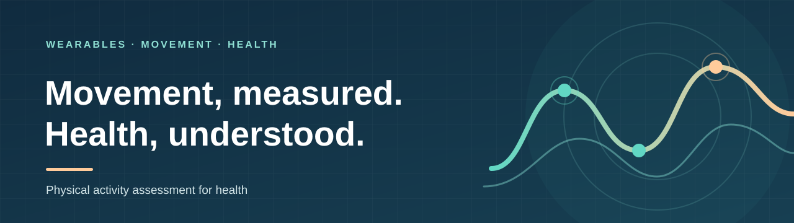

# Physical activity assessment for health

*University of Jyväskylä · Faculty of Sport and Health Sciences · Finland*

> Measuring everyday movement to better understand health.

We study physical activity in everyday life and its links to health. Wearable sensors help us measure its volume, intensity, duration, frequency and type. Our goal is to develop methods that researchers and practitioners can use.

[Learn more about our group](https://www.jyu.fi/en/research-groups/physical-activity-assessment-for-health) · [Explore our repositories](https://github.com/orgs/Physical-activity-assessment-for-health/repositories)

## What we study

We also look at what activity means relative to a person's physical capacity. Much of our recent work examines movement and mobility in older adults.

## Selected research

- [Association between physical activity bout length and physical functioning in older adults using absolute and relative intensity thresholds: A longitudinal cohort study](https://academic.oup.com/biomedgerontology/advance-article-abstract/doi/10.1093/gerona/glag219/8782782) · *The Journals of Gerontology: Series A*, 2026
- [Use it or lose it: a four-year follow-up assessing whether physical activity near one’s capacity reduces the risk of functional decline among older adults](https://link.springer.com/article/10.1186/s11556-025-00385-8) · *European Review of Aging and Physical Activity*, 2025
- [Physical determinants of daily physical activity in older men and women](https://journals.plos.org/plosone/article?id=10.1371/journal.pone.0314456) · *PLOS ONE*, 2025
- [Individual scaling of accelerometry to preferred walking speed in the assessment of physical activity in older adults](https://academic.oup.com/biomedgerontology/article-abstract/75/9/e111/5854333) · *The Journals of Gerontology: Series A*, 2020
- [Individual responses to combined endurance and strength training in older adults](https://pubmed.ncbi.nlm.nih.gov/20689460/) · *Medicine & Science in Sports & Exercise*, 2011

See [more publications from our group](https://www.jyu.fi/en/research-groups/physical-activity-assessment-for-health).

## Our team

Our group is led by [Laura Karavirta](https://www.jyu.fi/en/people/laura-karavirta). You can [meet the team](https://www.jyu.fi/en/research-groups/physical-activity-assessment-for-health) and find contact details on our university page.

We plan to share code and other resources here as they become available.
